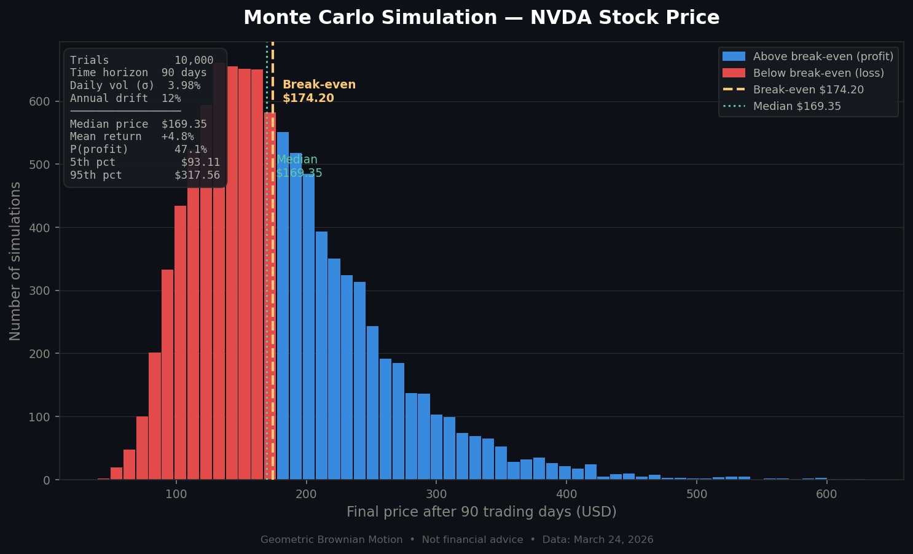

# Monte Carlo Stock Price Simulation — NVDA


A Monte Carlo simulation of future stock price paths for **Nvidia (NVDA)** — the #1 weighted component of the S&P 500 (~7.17%) — using **Geometric Brownian Motion (GBM)**.


---

## What is Monte Carlo simulation?

Monte Carlo simulation runs thousands of randomised trials of an uncertain outcome to build a probability distribution of results. Instead of predicting *one* future price, we simulate *10,000 possible futures* and ask:

- What is the median outcome?
- What is the probability of profit?
- What do the tails look like?

---

## Model — Geometric Brownian Motion

Each simulated price path follows:

$$S_t = S_0 \cdot \exp\left[\left(\mu - \frac{\sigma^2}{2}\right)t + \sigma \sqrt{t} \cdot Z\right]$$

| Parameter | Symbol | Value | Source |
|-----------|--------|-------|--------|
| Starting price | $S_0$ | $174.20 | March 24, 2026 |
| Daily volatility | $\sigma$ | 3.98% | TradingView 30-day HV |
| Annual drift | $\mu$ | 12% | Historical S&P 500 avg |
| Time horizon | $T$ | 90 trading days | Default |
| Trials | $N$ | 10,000 | Default |

---

## Output

The simulation produces:
- A **histogram** of 10,000 final prices after the chosen time horizon
- A **break-even line** (current price) dividing profit/loss zones
- A **median line** showing the central tendency
- A **stats box** with key percentiles, mean return, and P(profit)



---

## Installation

```bash
git clone https://github.com/YOUR_USERNAME/monte-carlo-stock-simulation.git
cd monte-carlo-stock-simulation
pip install -r requirements.txt
```

---

## Usage

**Run with defaults (NVDA, 90 days, 10,000 trials):**
```bash
python monte_carlo_nvda.py
```

**Custom parameters:**
```bash
python monte_carlo_nvda.py \
  --price 174.20 \
  --days 180 \
  --trials 20000 \
  --sigma 0.0398 \
  --mu 0.12 \
  --seed 42 \
  --output my_simulation.png
```

**All arguments:**

| Argument | Default | Description |
|----------|---------|-------------|
| `--price` | 174.20 | Starting stock price (USD) |
| `--days` | 90 | Trading days to simulate |
| `--trials` | 10000 | Number of Monte Carlo paths |
| `--sigma` | 0.0398 | Daily volatility (e.g. 0.0398 = 3.98%) |
| `--mu` | 0.12 | Annual drift (e.g. 0.12 = 12%) |
| `--seed` | None | Random seed for reproducibility |
| `--output` | monte_carlo_nvda.png | Output chart filename |

---

## Example console output

```
Running 10,000 simulations over 90 trading days...

════════════════════════════════════════════════
  NVDA Monte Carlo Simulation — Summary
════════════════════════════════════════════════
  Starting price      : $174.20
  Time horizon        : 90 trading days
  Trials              : 10,000
  Daily volatility σ  : 3.98%
  Annual drift μ      : 12%
────────────────────────────────────────────────
  Median final price  : $183.41
  Mean return         : +5.23%
  P(profit)           : 56.8%
  5th percentile      : $118.30
  25th percentile     : $155.60
  75th percentile     : $215.40
  95th percentile     : $271.80
════════════════════════════════════════════════
```

---

## Project structure

```
monte-carlo-stock-simulation/
├── monte_carlo_nvda.py   # main simulation script
├── requirements.txt      # dependencies
├── monte_carlo_nvda.png  # sample output chart
└── README.md             # this file
```

---

## Limitations

- GBM assumes **constant volatility** — real volatility is stochastic (see Heston model)
- Does not account for **jumps**, earnings surprises, or macro shocks
- Annual drift is a rough assumption, not fitted to NVDA's actual returns
- Past volatility does not predict future volatility

---

## Disclaimer

> This project is for **educational purposes only**. Nothing here constitutes financial advice. Do not make investment decisions based on this simulation.

---

## License

MIT — free to use, modify, and distribute.
